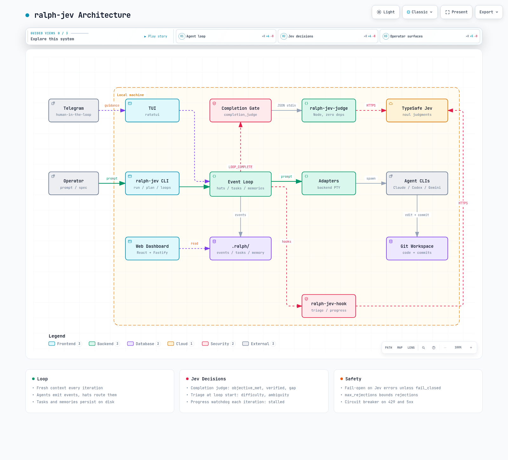
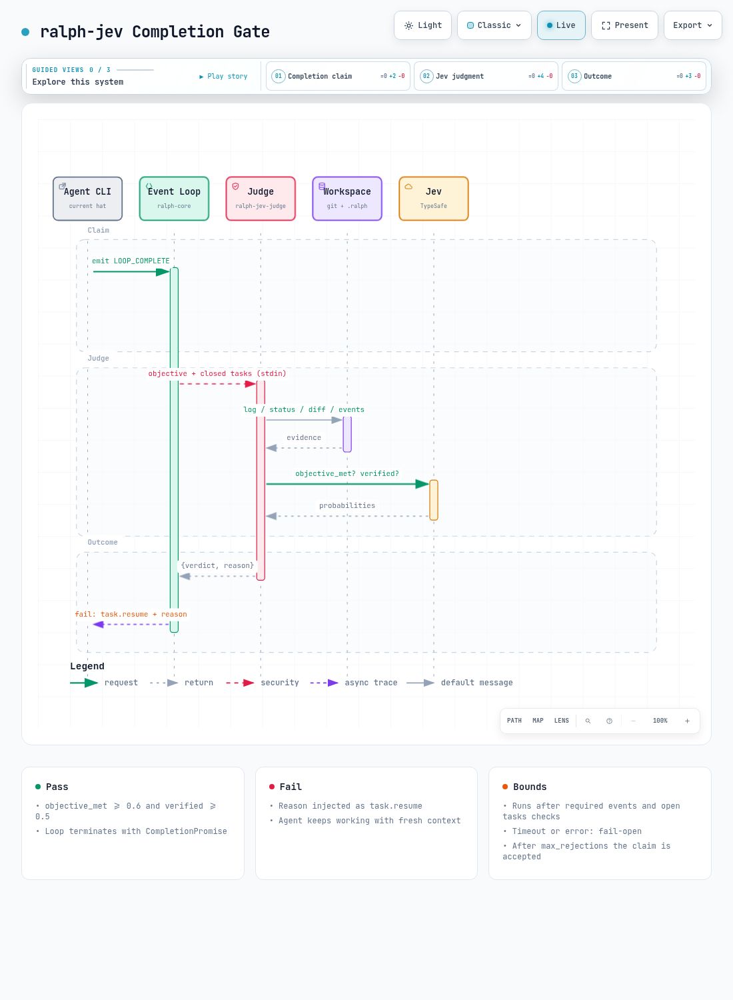

# ralph-jev

An autonomous agent loop that doesn't end until a judge agrees the work is done.

Inspired by the Ralph loop technique (`while :; do cat PROMPT.md | agent; done`), ralph-jev runs your coding agent (Claude Code, Codex, Gemini CLI, Kiro and others) with a fresh context on every iteration, using events, hats, tasks and memories on disk. When the agent says it's finished, [TypeSafe Jev](https://typesafe.ai) checks the claim before the loop is allowed to end.



## Why

In any agent loop, the agent eventually says `LOOP_COMPLETE` even though the work isn't finished: a missing piece, a test that never ran, a plan written up as if it were the result. ralph-jev adds a completion gate. Jev returns typed probabilities, not generated text, so the check is quick and cheap, and the loop keeps going with the reason whenever the evidence doesn't support the claim.

## How the completion gate works



1. The agent emits `LOOP_COMPLETE`.
2. The loop runs its built-in checks: required events seen, human guidance acknowledged, no open tasks.
3. `event_loop.completion_judge` runs an external command. The command gets the loop context as JSON on stdin and prints `{"verdict":"pass"|"fail","reason":"..."}`.
4. The default judge, `ralph-jev-judge`, collects evidence from the workspace (recent commits, `git status`, diff stat, closed tasks, recent events) and asks Jev two `noul` questions:

| Question | Default threshold | Env var |
|---|---|---|
| `objective_met`: is every part of the objective accomplished? | 0.6 | `RALPH_JEV_DONE_THRESHOLD` |
| `verified`: did tests, a build or another check actually run and pass? | 0.5 | `RALPH_JEV_VERIFIED_THRESHOLD` |

5. On **fail**, the loop publishes `task.resume` with the reason and the next iteration handles it. On **pass**, the loop ends.

Safety bounds:

- **Fail-open**: if the judge errors, times out or its circuit is open, the completion is accepted, unless you set `fail_closed: true`.
- **Rejection budget**: after `max_rejections` rejections, the completion is accepted so the loop can't get stuck.
- **Circuit breaker**: a 429 or 5xx from Jev pauses judge calls for `JEV_COOLDOWN_MS` (default 5 min), shared across processes through `~/.cache/ralph-jev/circuit.json`.

## Jev decision points

The completion gate is one of three places where Jev makes a typed decision about the loop:

| Point | Lifecycle event | Jev questions | Effect |
|---|---|---|---|
| **Completion judge** | `LOOP_COMPLETE` | `objective_met` (noul), `verified` (noul), `gap` (choice) | Rejects the completion and tells the agent what to fix next |
| **Triage** | `pre.loop.start` | `difficulty` (score, 4 levels), `ambiguous` (noul) | Warns when `max_iterations` is too low or the objective has no clear definition of done |
| **Progress watchdog** | `pre.iteration.start` | `stalled` (noul) | Flags a loop that keeps repeating the same step or failure |

The completion judge's `gap` choice picks one of `implementation_missing`, `tests_missing`, `checks_failing`, `off_objective` or `none`, and the rejection message turns it into a next step, for example:

```
Completion rejected by judge: Jev does not see the objective fully accomplished
(objective_met=0.03 verified=0.05 gap=checks_failing); next: fix the failing checks and rerun them
```

Triage and the progress watchdog run as lifecycle hooks through `ralph-jev-hook <triage|progress>`. They write their scores to hook metadata (`metadata.accumulated.hook_metadata.<hook>`), print warnings on stderr and exit with a non-zero code when their threshold is crossed. `on_error` sets what happens next:

- `warn` (default): log it and keep going.
- `block`: stop the loop.
- `suspend`: pause the loop until you resume it.

| Env var | Default | Used by |
|---|---|---|
| `RALPH_JEV_AMBIGUOUS_THRESHOLD` | 0.7 | triage |
| `RALPH_JEV_STALL_THRESHOLD` | 0.75 | progress |
| `RALPH_JEV_PROGRESS_MIN_ITERATION` | 3 | progress |
| `RALPH_JEV_TIMEOUT_MS` | 30000 | all |
| `JEV_MODEL` | `jev-latest` | all |

Interactive diagrams: [architecture.html](docs/architecture/architecture.html), [completion-gate.html](docs/architecture/completion-gate.html).

## Install

Requirements: Rust (edition 2024), Node.js 18+, git, and at least one agent CLI.

```bash
git clone https://github.com/flaviomartil/ralph-jev.git
cd ralph-jev
jev/install.sh
```

The installer builds the release binary and links `ralph-jev`, `ralph-jev-judge` and `ralph-jev-hook` into `~/.local/bin`. It also enables the judge and hooks in `~/.ralph/config.yml` when it can do so without conflicts; otherwise it tells you to merge `jev/ralph.jev.yml` by hand.

Jev credentials: set `TYPESAFE_API_KEY`, or keep it in `~/.config/jev-browser-use/.env`.

## Usage

```bash
ralph-jev init --backend claude
ralph-jev run -p "Add a header before the <p> tag and cover it with a test" --max-iterations 10
ralph-jev loops
```

Per-project configuration in `ralph.yml` (the same block as `jev/ralph.jev.yml`):

```yaml
event_loop:
  completion_judge:
    command: ["ralph-jev-judge"]
    timeout_seconds: 60
    max_rejections: 3
    fail_closed: false

hooks:
  enabled: true
  events:
    pre.loop.start:
      - name: jev-triage
        command: ["ralph-jev-hook", "triage"]
        on_error: warn
        mutate:
          enabled: true
    pre.iteration.start:
      - name: jev-progress
        command: ["ralph-jev-hook", "progress"]
        on_error: suspend
        mutate:
          enabled: true
```

Check it with `ralph-jev hooks validate -c ralph.yml`.

Any executable that follows the stdin/stdout contract can be a judge, so you can swap Jev for a test runner, a linter or another model.

### Judge contract

stdin:

```json
{
  "schema_version": 1,
  "objective": "Add a header before the <p> tag",
  "completion_promise": "LOOP_COMPLETE",
  "iteration": 4,
  "rejections": 0,
  "workspace": "/path/to/repo",
  "loop_id": null,
  "closed_tasks": ["Write header test", "Implement header"]
}
```

stdout (last non-empty line):

```json
{"verdict": "fail", "reason": "Jev sees no passing verification evidence such as tests or build (objective_met=0.82 verified=0.21)"}
```

A non-zero exit code counts as a judge error.

## Components

| Path | Role |
|---|---|
| `crates/ralph-cli` | CLI: `run`, `plan`, `loops`, `web`, `tools` |
| `crates/ralph-core` | Event loop, hats, tasks, memories, hooks, completion gate |
| `crates/ralph-core/src/completion_judge.rs` | Runs the judge, handles the timeout and parses the verdict |
| `crates/ralph-adapters` | Agent backends (Claude, Codex, Gemini, Kiro, Roo, ...) |
| `crates/ralph-tui` | Terminal UI |
| `crates/ralph-telegram` | Human-in-the-loop over Telegram |
| `backend/`, `frontend/` | Web dashboard |
| `jev/ralph-jev-judge.mjs` | Default Jev completion judge |
| `jev/ralph-jev-hook.mjs` | Jev triage and progress hooks |
| `jev/lib/jev.mjs` | Shared Jev client: credentials, circuit breaker, evidence collection (no dependencies) |
| `jev/install.sh` | Build and install |
| `docs/architecture/` | Archify diagram specs and renders |

## Development

```bash
cargo build
cargo test -p ralph-core
cargo test -p ralph-core completion_judge
node --test jev/test/*.test.mjs
```

## License

MIT. See [LICENSE](LICENSE).
